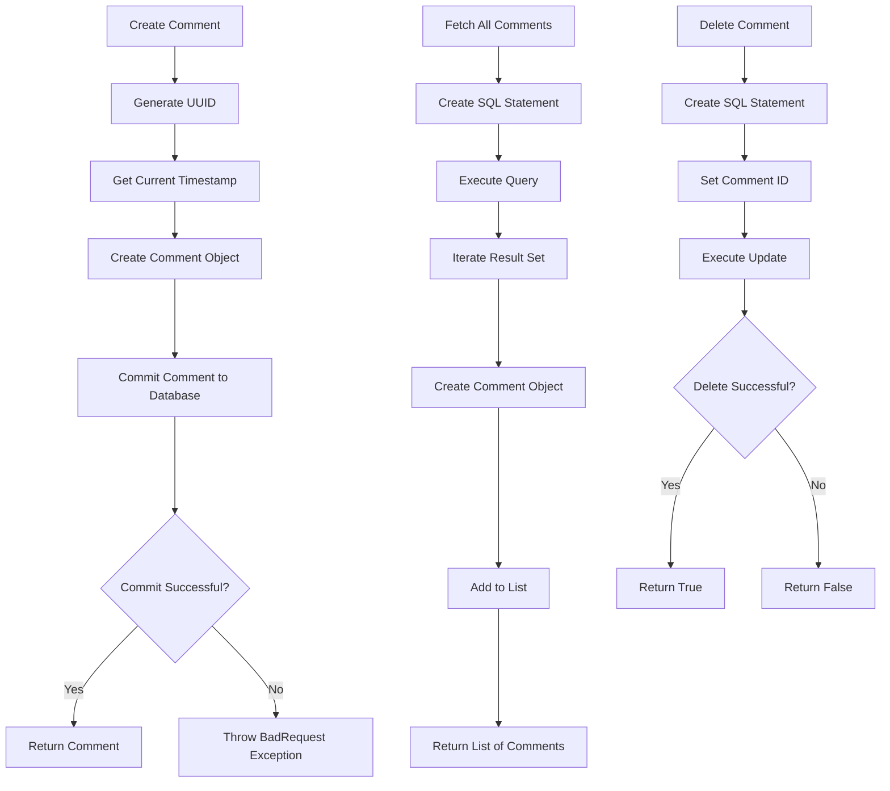
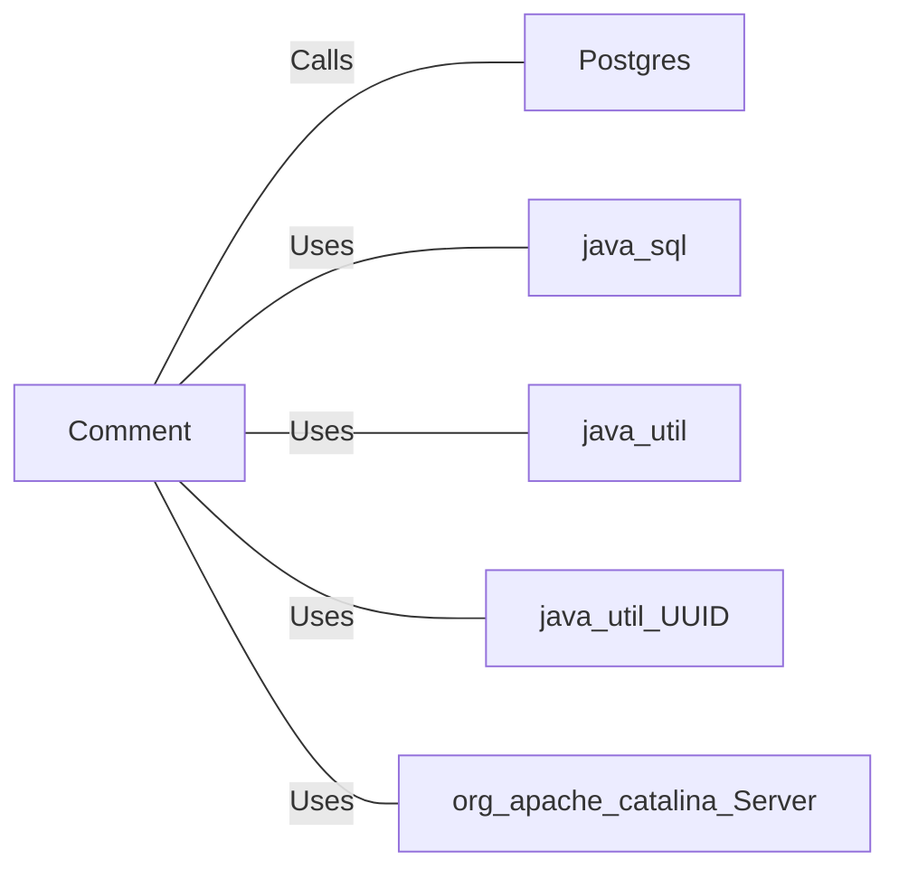

# Comment.java: Comment Management

## Overview

This program manages comments, including creating, fetching, and deleting comments. It interacts with a PostgreSQL database to store and retrieve comment data.

## Process Flow

## Insights

- The program uses UUIDs to uniquely identify comments.
- Comments are timestamped with the creation time.
- The program handles database interactions for creating, fetching, and deleting comments.
- Error handling is implemented to manage database operation failures.

## Dependencies

- `Postgres`: Provides database connection for executing SQL queries.
- `java.sql`: Used for SQL operations and handling SQL exceptions.
- `java.util`: Used for date and list operations.
- `java.util.UUID`: Used for generating unique identifiers for comments.
- `org.apache.catalina.Server`: Used for server-related operations.

## Data Manipulation (SQL)

### Table: comments

| Attribute   | Type      | Description                  |
|-------------|-----------|------------------------------|
| id          | String    | Unique identifier for comment|
| username    | String    | Username of the commenter    |
| body        | String    | Content of the comment       |
| created_on  | Timestamp | Timestamp of comment creation|

### SQL Operations

- **INSERT**: Adds a new comment to the `comments` table.
- **SELECT**: Retrieves all comments from the `comments` table.
- **DELETE**: Removes a comment from the `comments` table based on the comment ID.
