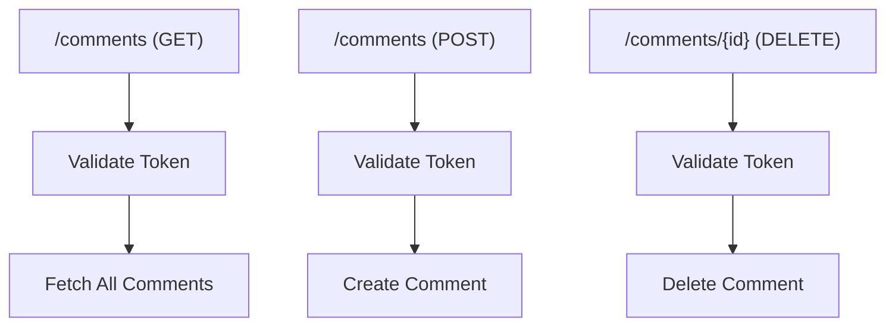
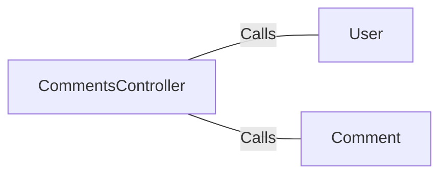

# CommentsController.java: Comment Management API

## Overview

This code defines a RESTful API for managing comments. It includes endpoints for fetching, creating, and deleting comments. The API uses token-based authentication to ensure secure access.

## Process Flow

## Insights

- The API uses token-based authentication for all endpoints.
- The `@CrossOrigin` annotation allows cross-origin requests from any domain.
- The `@Value` annotation is used to inject the application secret for authentication.
- The `CommentRequest` class is a data structure for handling comment creation requests.
- Custom exceptions `BadRequest` and `ServerError` are defined for handling specific error scenarios.

## Dependencies

- `User`: Validates the authentication token.
- `Comment`: Handles fetching, creating, and deleting comments.
