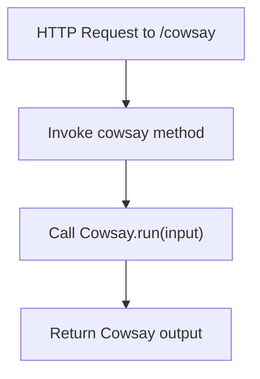
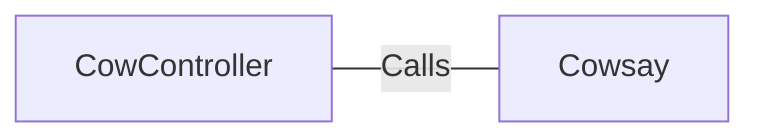

# CowController.java: Cow Say Controller

## Overview
This controller handles HTTP requests to the `/cowsay` endpoint, generating a response using the Cowsay utility.

## Process Flow

## Insights
- The controller is designed to handle HTTP GET requests to the `/cowsay` endpoint.
- It uses the `Cowsay` utility to generate a response based on the provided input.
- The default input message is "I love Linux!" if no input is provided.

## Dependencies

- `Cowsay`: Description of parameters provided when calling it and the nature of the relation and eventual longer description of it
