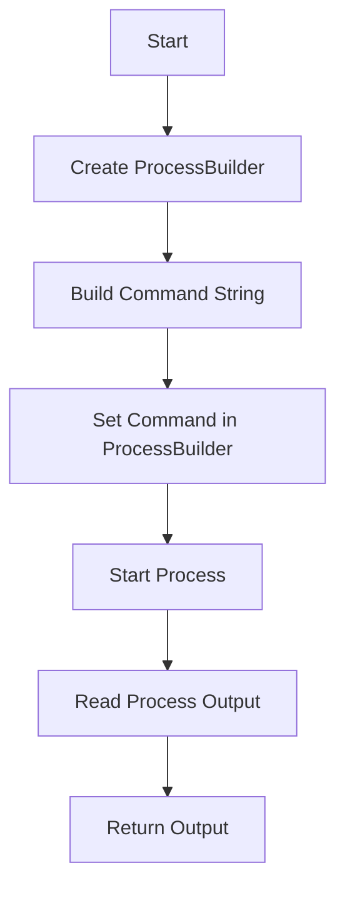

# Cowsay.java: Command Execution with Cowsay

## Overview

This program executes the `cowsay` command with a given input string and returns the output. It uses a `ProcessBuilder` to run the command in a bash shell and captures the output.

## Process Flow

## Insights

- The program constructs a command string to run `cowsay` with the provided input.
- It uses `ProcessBuilder` to execute the command in a bash shell.
- The output of the command is captured and returned as a string.
- Exception handling is in place to catch and print any errors that occur during the process execution.
