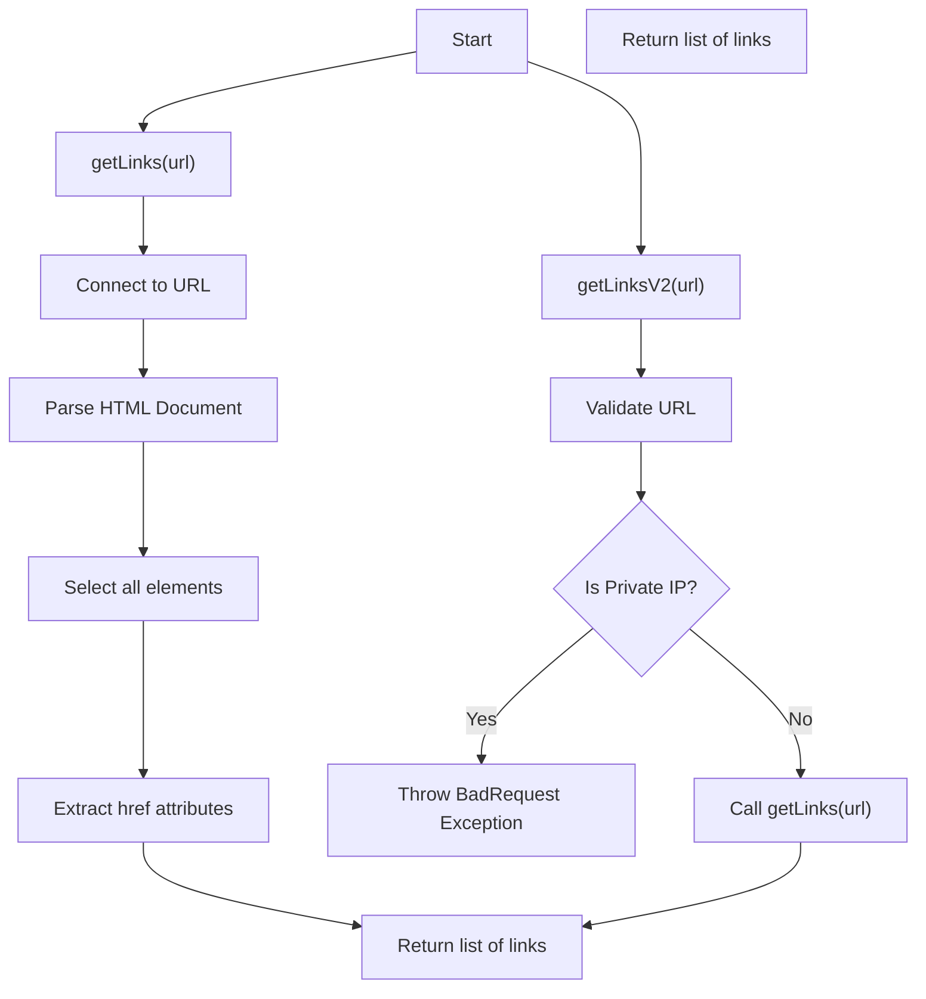
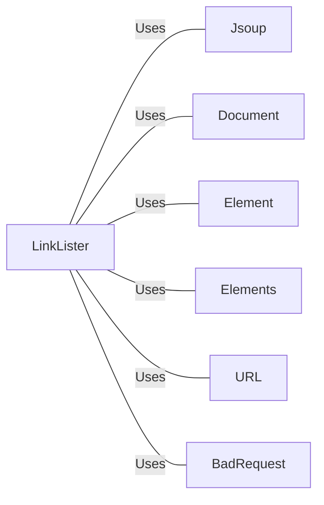

# LinkLister.java: URL Link Extractor

## Overview

The `LinkLister` class is responsible for extracting all hyperlinks from a given URL. It provides two methods for this purpose: `getLinks` and `getLinksV2`. The latter includes additional validation to prevent the use of private IP addresses.

## Process Flow

## Insights

- The `getLinks` method connects to a given URL, parses the HTML document, and extracts all hyperlinks.
- The `getLinksV2` method adds a validation step to ensure the URL does not point to a private IP address.
- If the URL is valid, `getLinksV2` calls `getLinks` to perform the actual extraction.
- Private IP addresses are identified by checking if the host starts with "172.", "192.168", or "10.".

## Dependencies

- `Jsoup`: Used to connect to the URL and parse the HTML document.
- `Document`: Represents the parsed HTML document.
- `Element`: Represents an HTML element.
- `Elements`: Represents a collection of HTML elements.
- `URL`: Used to validate the URL in `getLinksV2`.
- `BadRequest`: Custom exception thrown when a private IP address is detected.

## Data Manipulation (SQL)

- No SQL data manipulation detected.
