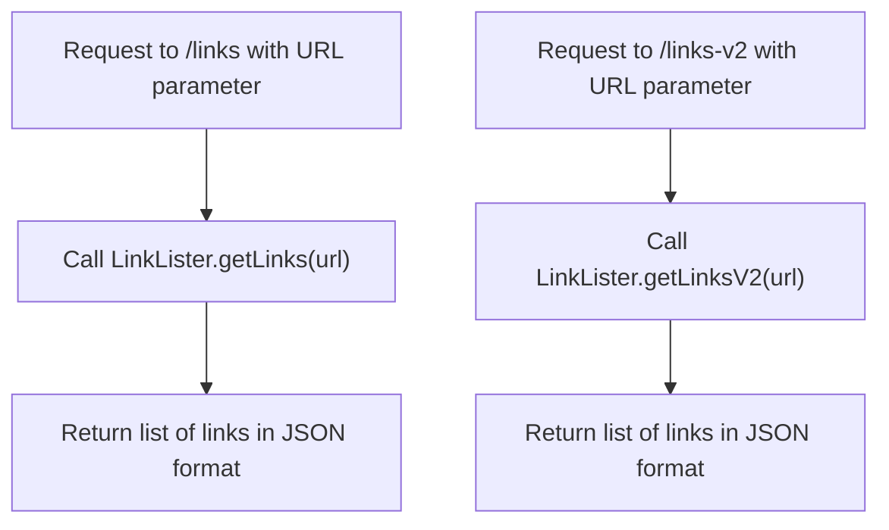
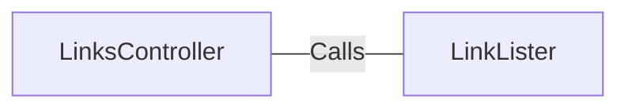

# LinksController.java: Link Management Controller

## Overview
This controller handles HTTP requests to retrieve links from a given URL. It provides two endpoints, `/links` and `/links-v2`, which return lists of links in JSON format.

## Process Flow

## Insights
- The controller has two endpoints: `/links` and `/links-v2`.
- Both endpoints accept a URL parameter and return a list of links in JSON format.
- The `/links` endpoint may throw an `IOException`.
- The `/links-v2` endpoint may throw a `BadRequest` exception.

## Dependencies

- `LinkLister`: Provides methods `getLinks(url)` and `getLinksV2(url)` to retrieve lists of links from the given URL.
