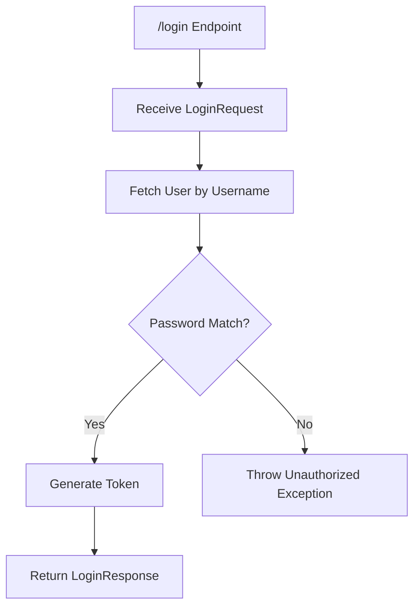
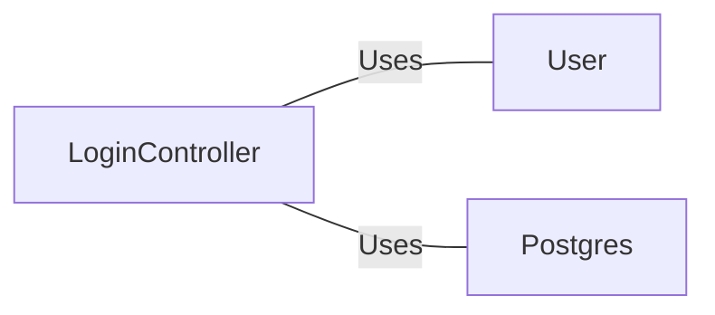

# LoginController.java: User Authentication Controller

## Overview
This code handles user authentication by verifying the provided credentials against stored user data. It returns a token if the authentication is successful or throws an error if it fails.

## Process Flow

## Insights
- The `LoginController` class is responsible for handling login requests.
- The `login` method processes the login request and returns a token if the credentials are valid.
- The `LoginRequest` class represents the structure of the login request payload.
- The `LoginResponse` class represents the structure of the login response payload.
- The `Unauthorized` class is used to handle unauthorized access attempts.

## Dependencies

- `User`: Fetches user data based on the username.
- `Postgres`: Validates the password by comparing the hashed values.
