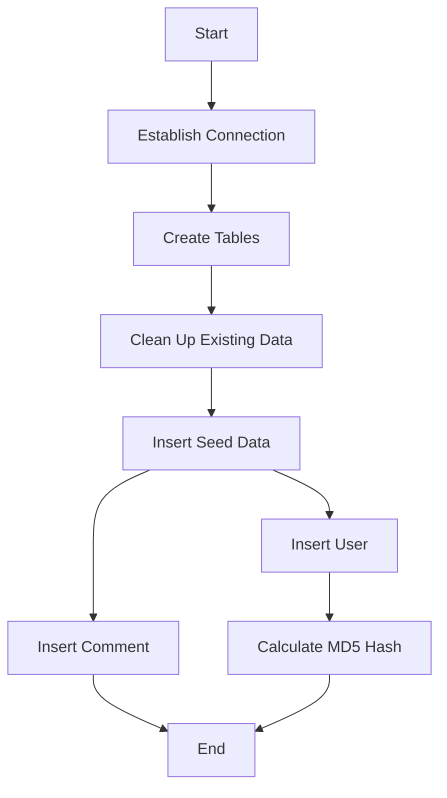

# Postgres.java: Database Setup and Management

## Overview

This program is responsible for setting up and managing a PostgreSQL database. It includes functionalities to establish a connection, create necessary tables, clean up existing data, insert seed data, and calculate MD5 hash values for passwords.

## Process Flow

## Insights

- The program establishes a connection to a PostgreSQL database using environment variables for configuration.
- It creates two tables: `users` and `comments`.
- Existing data in these tables is deleted before inserting seed data.
- User passwords are stored as MD5 hash values.
- The program includes methods to insert users and comments into the database.

## Data Manipulation (SQL)

### Tables

| Table Name | Column Name | Data Type | Description |
|------------|-------------|-----------|-------------|
| users      | user_id     | VARCHAR(36) | Primary key, unique identifier for the user |
|            | username    | VARCHAR(50) | Unique username for the user |
|            | password    | VARCHAR(50) | MD5 hashed password |
|            | created_on  | TIMESTAMP   | Timestamp of user creation |
|            | last_login  | TIMESTAMP   | Timestamp of last login |
| comments   | id          | VARCHAR(36) | Primary key, unique identifier for the comment |
|            | username    | VARCHAR(36) | Username of the commenter |
|            | body        | VARCHAR(500)| Content of the comment |
|            | created_on  | TIMESTAMP   | Timestamp of comment creation |

### SQL Operations

- `CREATE TABLE IF NOT EXISTS users`: Creates the `users` table if it does not already exist.
- `CREATE TABLE IF NOT EXISTS comments`: Creates the `comments` table if it does not already exist.
- `DELETE FROM users`: Deletes all existing data from the `users` table.
- `DELETE FROM comments`: Deletes all existing data from the `comments` table.
- `INSERT INTO users`: Inserts a new user into the `users` table.
- `INSERT INTO comments`: Inserts a new comment into the `comments` table.
