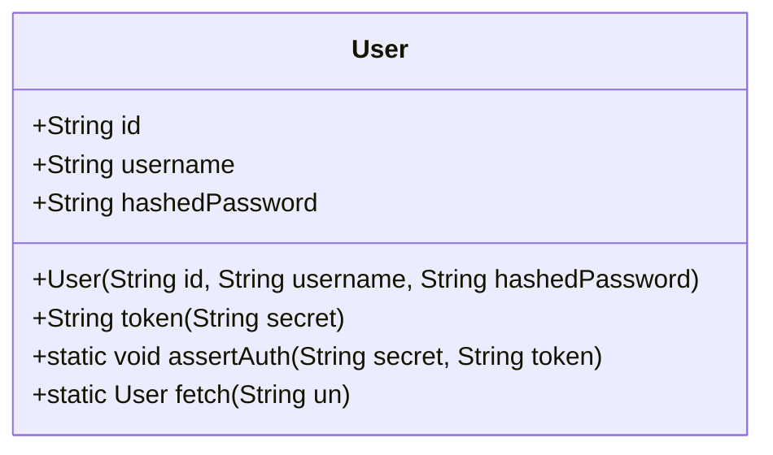
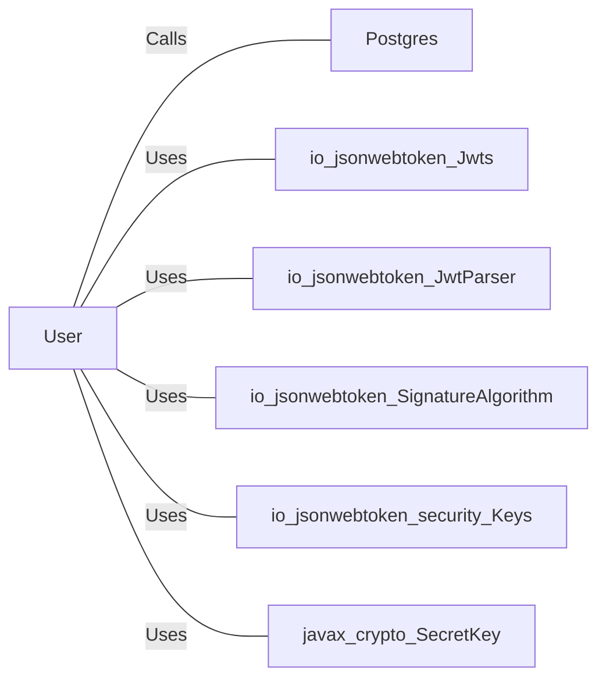

# User.java: User Management and Authentication

## Overview
This code defines a `User` class responsible for managing user information and handling authentication processes. It includes methods for generating JWT tokens, validating tokens, and fetching user data from a database.

## Process Flow

## Insights
- The `User` class handles user data and authentication.
- JWT tokens are generated and validated using the `io.jsonwebtoken` library.
- User data is fetched from a PostgreSQL database.

## Dependencies

- `Postgres`: Provides a connection to the PostgreSQL database.
- `io.jsonwebtoken.Jwts`: Used for building and parsing JWT tokens.
- `io.jsonwebtoken.JwtParser`: Used for parsing JWT tokens.
- `io.jsonwebtoken.SignatureAlgorithm`: Specifies the algorithm for signing JWT tokens.
- `io.jsonwebtoken.security.Keys`: Generates secret keys for signing JWT tokens.
- `javax.crypto.SecretKey`: Represents the secret key used for signing JWT tokens.
