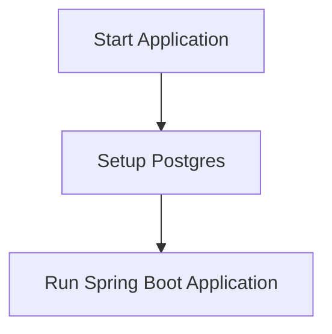
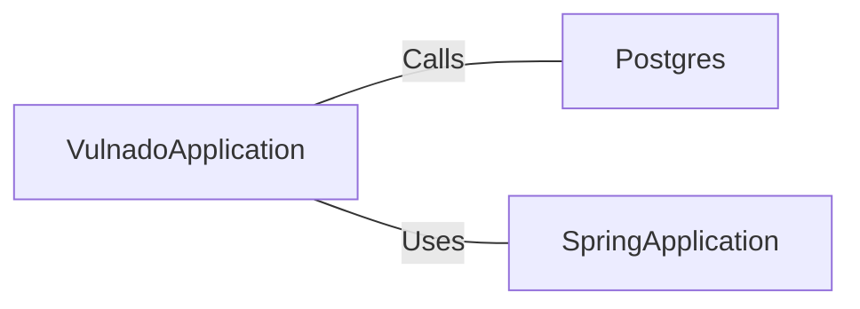

# VulnadoApplication.java: Application Entry Point

## Overview
This code serves as the entry point for the Vulnado application. It initializes the application by setting up the necessary configurations and starting the Spring Boot application.

## Process Flow

## Insights
- The application uses Spring Boot framework for initialization and configuration.
- The `Postgres.setup()` method is called to configure the PostgreSQL database before starting the application.
- The `@SpringBootApplication` annotation indicates that this is a Spring Boot application.
- The `@ServletComponentScan` annotation is used to scan for servlet components.

## Dependencies

- `Postgres`: Calls the `setup` method to configure the PostgreSQL database.
- `SpringApplication`: Uses the `run` method to start the Spring Boot application.
